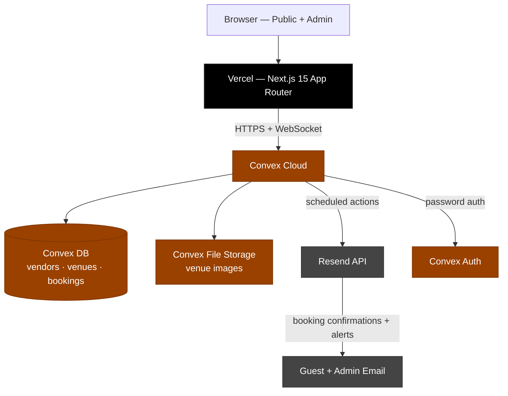

# Venora — Curated Venue Booking

> Built for the [KrackedDevs RM500 Bounty](https://krackeddevs.com). 48 hours.
> Live demo: **[https://venora-venue-booking.vercel.app](https://venora-venue-booking.vercel.app)**
> Demo video: **[<!-- TODO: add Loom URL -->](#)**

<!-- 📸 SCREENSHOT NEEDED: Venue detail page (Bento gallery + sticky pricing sidebar visible). Save to docs/screenshots/hero.png and replace this comment with:  -->

---

## What it does

Guests browse a curated venue, pick an available date, and submit a concierge booking request. Admins review requests in a real-time dashboard, approve or reject with one click, and emails fire automatically at each step. The guest receives a receipt page with an `.ics` calendar download and a permanent status-check link — no account required.

## Demo credentials

| Role  | URL            | Email          | Password |
| ----- | -------------- | -------------- | -------- |
| Admin | `/admin/login` | admin@demo.com | demo1234 |

**Public venue:** `/venues/the-grand-hall-kl`

---

## Tech stack


| Layer        | Choice                                    |
| ------------ | ----------------------------------------- |
| Framework    | Next.js 15 (App Router)                   |
| Styling      | Tailwind CSS v4                           |
| Components   | shadcn/ui (new-york preset)               |
| Backend / DB | Convex (queries, mutations, file storage) |
| Realtime     | Convex WebSocket subscriptions            |
| Auth         | @convex-dev/auth (password provider)      |
| Client state | Zustand (UI state only)                   |
| Forms        | React Hook Form + Zod                     |
| Email        | Resend + React Email                      |
| Deploy       | Vercel + Convex Cloud                     |

---

## Architecture



---

<!-- ## Screenshots

<!-- 📸 SCREENSHOT NEEDED (4 total — save to docs/screenshots/):
     1. landing.png   — hero + featured venue + Coming Soon section
     2. venue.png     — venue detail with Bento gallery open
     3. booking.png   — Concierge Request form with pill chips
     4. admin.png     — Command Center: stats cards + Activity Feed + bookings table

     Replace each comment block below with the corresponding image tag once captured. -->

<!--  -->
<!--  -->
<!--  -->
<!--  -->

--- -->

## Key technical decisions

### Multi-tenant from day one

The schema models a full marketplace: `vendors → venues → bookings` with proper denormalization for admin queries. Single-venue mode is gated by one env flag (`NEXT_PUBLIC_SINGLE_VENUE_MODE`). The "Coming Soon" venue cards preview v2 listings without touching the schema. Zero throwaway code — every table serves the Phase 2 roadmap.

### Real-time without complexity

Convex's `useQuery` hooks maintain WebSocket subscriptions automatically. When an admin approves a booking: the mutation runs, all subscribers (dashboard, date picker, guest receipt page) update within ~200ms. No TanStack Query, no Pusher, no Redis, no polling.

### Email via Convex scheduled actions

Mutations schedule Convex internal actions via `ctx.scheduler.runAfter(0, ...)`. The mutation completes immediately; email fires asynchronously. If Resend fails, the booking is unaffected — only the email is lost (logged to Convex's built-in action log). Three email events: booking submitted (guest), status changed (guest), new booking alert (admin).

### Receipt-first confirmation flow

The booking confirmation page at `/booking/[token]` functions as a digital receipt — formatted detail card, `.ics` calendar download (all-day event, no timezone bugs), and a clipboard copy button for the permanent status-check URL. No account required. The `publicToken` is a 21-char nanoid on every booking.

### Pragmatic auth

Convex Auth password provider for v1. The schema and routing already support OAuth — adding Google login takes ~10 lines.

---

## Features

- **Venue detail page** — Bento photo gallery with dialog lightbox, amenities grouped by category, capacity, pricing
- **Live availability calendar** — disabled dates reflect approved bookings in real-time via Convex subscriptions
- **Concierge booking form** — RHF + Zod validation, event type pill chips, guest count stepper
- **Booking receipt page** — formatted confirmation card, `.ics` calendar download, clipboard status link
- **Admin Command Center** — stats cards (total / pending / approved / approval rate), live Activity Feed
- **Bookings table** — real-time updates, status filter tabs, text search, sortable columns
- **Approve / Reject flow** — one-click actions with optional notes, optimistic UI
- **Email notifications** — booking submitted, status changed, new booking alert (Resend + React Email)
- **Coming Soon section** — 3 teaser venue cards positioning Venora as a curated marketplace
- **Mobile responsive** — tested at 375px (iPhone SE)

---

## Local setup

**Prerequisites:** Node 20+, pnpm, Convex account, Resend account

```bash
# 1. Clone and install
git clone <repo-url>
cd venora-venue-booking-app-bounty
pnpm install

# 2. Start Convex (creates .env.local automatically)
pnpm dlx convex dev

# 3. Add to .env.local
NEXT_PUBLIC_APP_NAME=Venora
NEXT_PUBLIC_SINGLE_VENUE_MODE=true
NEXT_PUBLIC_SINGLE_VENUE_SLUG=the-grand-hall-kl

# 4. Set Resend keys in Convex env (not .env.local — emails run in Convex actions)
pnpm dlx convex env set RESEND_API_KEY re_your_key_here
pnpm dlx convex env set RESEND_FROM_EMAIL onboarding@resend.dev
pnpm dlx convex env set ADMIN_NOTIFICATION_EMAIL your@email.com

# 5. Seed the database
pnpm dlx convex run seed:default

# 6. Run
pnpm dev
```

Open [http://localhost:3000](http://localhost:3000).

---

## Phase 2 roadmap

- **Multi-vendor mode** — vendor signup, super-admin approval queue, per-vendor dashboards
- **Hourly booking slots** — schema already supports `bookingMode: "hourly"`, UI deferred
- **Payment integration** — Stripe or Billplz checkout before confirmation
- **New venues** — The Conservatory (Penang), The Vault (KL), Skyline Atelier (Mont Kiara) go live
- **Google OAuth** — one env var + ~10 lines on the existing Convex Auth setup

---

## Bounty requirements checklist

- [x] Guests can browse a venue and view details (photos, description, amenities, pricing)
- [x] Guests can check date availability before booking
- [x] Guests can submit a booking request with name, email, phone, event type, date, guest count
- [x] Guests receive a confirmation email on submission
- [x] Guests can check booking status via a unique public link (no account required)
- [x] Admins can log in to a protected dashboard
- [x] Admins can view all booking requests in real-time
- [x] Admins can approve or reject bookings
- [x] Guests receive an email when their booking status changes
- [x] App is deployed and publicly accessible

---

## Known limitations

- Email sender uses Resend's shared `onboarding@resend.dev` — may land in spam. Production needs a verified domain.
- Venue details (name, images, address) are set via seed / Convex dashboard — no admin UI for editing in v1.
- No payment processing (per bounty scope).

---

## Project structure

```
app/
  (public)/         # Guest pages: landing, venue detail, booking form, receipt
  admin/            # Admin pages: login, dashboard
convex/             # Schema, queries, mutations, scheduled actions, seed
components/
  booking/          # BookingForm, ReceiptCard, StatusBadge, AddToCalendarButton
  venue/            # VenueHero, VenueGallery, AmenitiesList
  admin/            # BookingsTable, BookingDetailSheet, DashboardStats
  landing/          # ComingSoonVenues, TestimonialSection
emails/             # React Email templates
lib/                # validators, utils, config, ics-generator, short-id
stores/             # Zustand: admin UI state
```

---

Built by **Irfan Murad (1nfra)** for the KrackedDevs RM500 Venue Booking Bounty.
